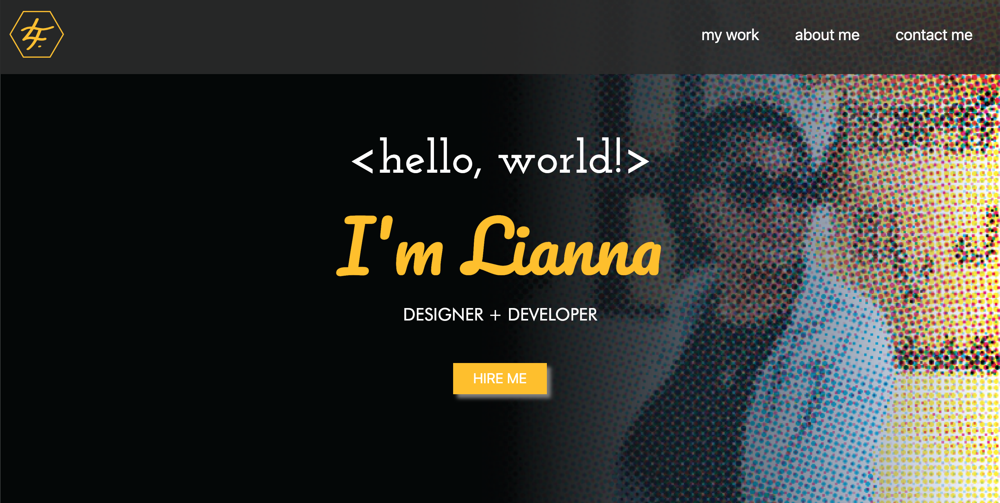

# Bootstrap-Portfolio

## Description

This assignment was to build my portfolio layout using the Bootstrap CSS Framework.

### Tasks completed
* Page created using Bootstrap.
* Navigation menu includes links to sections about me, my work and how to contact me.
* When one of the links is clicked, UI jumps to corresponding section.
* A jumbotron featuring my name and picture.
* My Work section created using Bootstrap cards.
* A skills section included.

** NOTE:
The applications on the page are examples projects I have done for friends and family over the years, using Wix.com.

With the exception of my portfolio,
I did not create any of the code and have included them here as placeholders.
The first application does not include a link as it is no longer active.

### Links

Deployed website: (https://lianna87.github.io/Bootstrap-Portfolio/)

Code repository:(https://github.com/Lianna87/Bootstrap-Portfolio)

Prevously deployed portfolio (https://github.com/Lianna87/Bootstrap-Portfolio)

#### Usage

The webpage can be viewed in a traditional desktop web browser, table or phone once deployed. 

#### Screenshots

